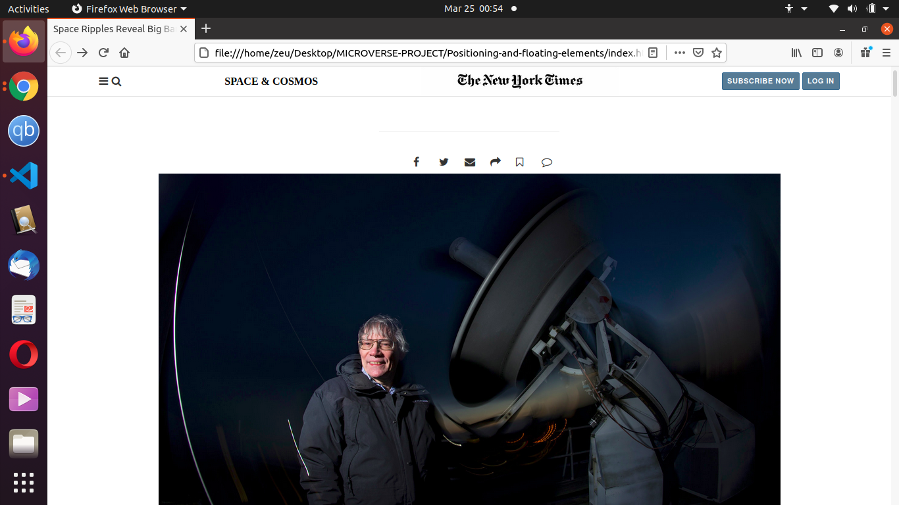

> A copy of the web page of the NYT. This project helps us practise our skills on float, flex and grid. 

Additional description about the project and its features.

## Built With

- HTML
- CSS

## Live Demo

[Live Demo Link](https://fondem-jr.github.io/Positioning-and-floating-elements/)

## Getting Started

**This is an example of how you may give instructions on setting up your project locally.**
**Modify this file to match your project, remove sections that don't apply. For example: delete the testing section if the currect project doesn't require testing.**

## Authors

👤 **Author1**

- GitHub: [@githubhandle](https://github.com/Fondem-Jr/)
- Twitter: [@twitterhandle](https://twitter.com/OpportunistZeus)
- LinkedIn: [LinkedIn](https://www.linkedin.com/in/fondem-junior-57484744)

## 🤝 Contributing

Contributions, issues, and feature requests are welcome!

Feel free to check the [issues page](issues/).

## Show your support

Give a ⭐️ if you like this project!

## Acknowledgments

## 📝 License

This project is [MIT](lic.url) licensed.
